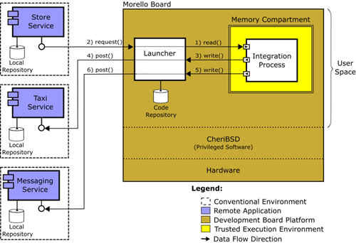
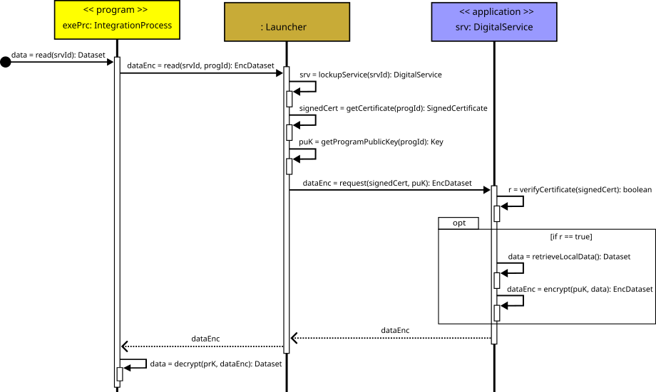
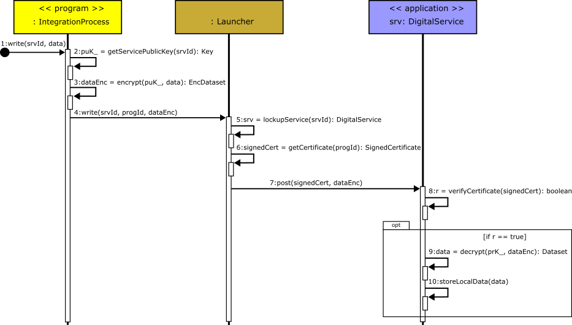

<h1 style="font-size: 2em;">A Use-case for Integrating Digital Services with Data Protection at Run Time</h1>

This repository focuses on evaluating two key attestable properties:

- The operation of the cloud-based attestation procedure discussed in the [attestablelauncher repository](https://github.com/CAMB-DSbD/attestablelauncher).
- Some performance properties of compartments created on a Morello Board, using a library compartmentalisation tool.

To explore these properties, we have implemented an **Enterprise Application Integration (EAI)** solution, also referred to as an **Integration Process**, which operates within a trusted execution environment (TEE) on experimental Morello Board hardware.

We demonstrate how to execute an integration process within a TEE using Morello Board hardware located in Canada. The case study implements three mock digital services (apps) running on distinct remote servers in Brazil, along with an integration process (program) written and compiled for **CHERI capabilities (cheri-caps)**. The integration process runs inside a secure compartment.


## Integration Problem Overview

A conceptual view of the application involved in the EAI is illustrated in **Figure 1**. 


<!-- -->


*Figure 1: Conceptual View of the EAI.* 
<!--(Author: Carlos Molina-Jimenez, Computer Lab, University of Cambridge. CAMB project).-->


The scenario represents a strategy implemented by a store to attract and retain customers: it offers free transport back home to customers who spend at least \$150 in the store. The rewarded customers receive booking confirmation messages on their mobile phones. The integration process is responsible for automating and securely coordinating the interactions among three independent digital services:

- **Store Service:** Provides details about customers (e.g., mobile phone number and address) and their purchases (e.g., items purchased and prices).  
- **Taxi Service:** Schedules transportation.  
- **Messaging Service:** Sends booking confirmation messages.  

To automate the coordination, the integration process executes the following *read* and *write* actions:

1. **Read Action:** Periodically executes *read* actions on the Store Service to retrieve customers' transaction details.  
2. **Eligibility Check:** Identifies customers who are eligible for free transport based on their purchase amount.  
3. **Write Action (Taxi Service):** Executes a *write* action on the Taxi Service to request taxi services for the rewarded customers, including their personal details.  
4. **Write Action (Messaging Service):** Executes a *write* action on the Messaging Service to send booking confirmations to the awarded customers. These messages include the vehicle's description, the driver’s name, and the departure time.


## Integration Process Design

As shown in Figure 2, to guarantee data privacy, we execute the integration process within a memory compartment. To illustrate the idea with a specific technology, we use compartments created on a Morello Board running the CheriBSD operating system. As explained above, the digital services are hosted on conventional computers. The architecture is composed of three main components: the `Launcher`, the `Integration Process`, and the `Digital Services`. Observe that the integration process acts as a client that places requests, through the Launcher, against the digital services that act as servers.



*Figure 2: Architecture of the integration process solution in the case study, designed using a trusted environment development approach.*  
<!-- (Author: Carlos Molina-Jimenez, Computer Lab, University of Cambridge. CAMB project) -->

The memory compartment is shown in a yellow box; the double lines indicate that it guarantees isolation and protection of sensitive data. The Launcher manages the interactions between the integration process and the digital services. Upon request from the Morello Board's manager, the Launcher retrieves the source code of the integration process from the `Code Repository`, then compiles and deploys the executable version in the memory compartment. Although the Launcher bridges the *read* and *write* actions, it does not have access to the data in transit since the data is always encrypted and decrypted at both ends.

To illustrate with an example, imagine that the integration process wants to verify if there are customers eligible for free taxis; a set of operations must be executed:

1. The `Integration Process` executes a `read()` action on the `Launcher`.
2. The `Launcher` translates the `read()` to a `request()` and forwards it to the `Store Service`, which responds with customers' latest transactions.
3. After examination, the `Integration Process` determines that there are eligible customers for free taxis and executes a `write()` action against the `Launcher` to send the eligible customers' details to the `Taxi Service`.
4. As a response, the `Launcher` translates the `write()` into a `post()` and forwards it to the `Taxi Service`.
5. The `Integration Process` executes a `write()` action on the `Launcher` to send the taxi booking confirmation to the `Messaging Service`.
6. The `Launcher` translates the `write()` into a `post()` and forwards it to the `Messaging Service`, which is programmed to send taxi booking confirmation messages to the awarded customers' mobile phones.

Note that data is transmitted encrypted over the communication channels. Well-known cryptographic techniques are available for protecting data in transit; for example, secure channels can be established between integration processes and each digital service using the SSL protocol. This approach would require public key certificates for authentication, which are also available.

<!--To illustrate the practicality of our current implementation, we highlight that the attestable is created on a Morello Board physically located in Toronto, while the applications run on conventional computers located at the Applied Computing Research Group of the University of Ijuí, Brazil.-->


# Execution of a Read Action

The sequence diagram in Figure 3 details the operations involved. This diagram illustrates how the integration process requests data from a digital service (e.g., the Store Service).



*Figure 3. Operations to implement the read action for requesting data from a digital service.*


The reading action starts when the `read()` operation (1) in the integration process (`exePrc`) is invoked, receiving as a parameter the digital service identifier `srvId`, which specifies the service from which data must be read (e.g., the ID of the `Store Service`). This invocation triggers a sequence of operations to complete the *read* action:

1. The integration process invokes the `read()` operation, passing the identifier `srvId` of the digital service from which it needs to read data.

2. The integration process forwards the `read()` request to the `Launcher`, appending the program identifier `progId` to uniquely identify the requesting integration process and validate its execution within the memory compartment of the TEE.

3. The `Launcher` executes the `lookupService()` operation to locate the service instance associated with `srvId`. The execution returns a reference to the corresponding integrated digital service (e.g., the `Store Service`).

4. To verify the trustworthiness of the requesting integration process, the `Launcher` invokes its `getCertificate()` operation, passing the program identifier `progId`. This operation retrieves the attestable certificate (`SignedCertificate`), following the X.509 standard[^1], generated from an attestation document and stored in PEM format[^2]. This certificate encapsulates essential attributes, such as the CPU model and the operating system version.

5. The `Launcher` invokes the `getProgramPublicKey()` operation to retrieve the public key (`Key`) associated with the current integration process. This key will be used later to encrypt the data transmitted between the components.

6. With the service reference and necessary cryptographic artifacts retrieved, the `Launcher` invokes the `request()` operation on the digital service, providing the attestable certificate (`signedCert`) and the public key (`puK`). The digital service uses these to authenticate the request and confirm that it originates from a trusted environment.

7. Upon receiving the request, the digital service invokes its `verifyCertificate()` operation to validate the received certificate. The verification process involves:
   - **Step 1:** Checking whether the certificate was issued and signed by a trusted Root Certificate Authority (CA), such as VeriSign[^3], to ensure authenticity.  
   - **Step 2:** Validating the attestable attributes (e.g., CPU model and OS version) to confirm that the integration process is running within a trusted environment.

   If the certificate is invalid, the request is rejected, and no data is retrieved.

8. If the certificate is valid (`r == true`), the digital service retrieves the requested data (`Dataset`) locally using its `retrieveLocalData()` operation. The data can be structured, for example, in JSON format, to facilitate compatibility between digital services and integration processes.

9. To secure the data during transmission, the digital service invokes its `encrypt()` operation, encrypting the data using the public key (`puK`) of the integration process. The result is an encrypted dataset (`EncDataset`) that ensures confidentiality throughout the entire *read* action.

10. The encrypted dataset is securely transmitted (e.g., via HTTPS) to the `Launcher`, which forwards it to the integration process. Upon receiving the encrypted data, the integration process invokes its `decrypt()` operation using its private key (`prK`) to recover the original dataset (`Dataset`) and proceed with its processing.

---

[^1]: X.509 is a widely used standard for digital certificates.  
[^2]: PEM is an encoding format for storing digital certificates.  
[^3]: Root CA: [VeriSign](https://www.verisign.com/)


# Execution of a Write Action

The sequence diagram in Figure 4 details the operations involved. Similar to the *read* action, this diagram shows how the integration process (`exePrc`) securely transmits data to a digital service (e.g., the `Taxi Service`), following an ordered sequence of operations.



*Figure 4: Operations to implement the write action for posting data to a digital service.*


The *write* action starts when the `write()` operation (1) in the integration process is invoked. This operation receives as parameters the identifier `srvId` of the targeted digital service (e.g., the ID of the `Taxi Service` or `Messaging Service`) and the dataset `data` to be posted to the service. This invocation triggers the sequence of interactions required to complete the *write* action:

1. The integration process invokes the `write()` operation, specifying the target service identifier (`srvId`) and the dataset (`data`) to be transmitted.

2. To protect the transmitted data, the integration process invokes its `getServicePublicKey()` operation to retrieve the public key (`puK_`) of the target digital service. This ensures that only the intended service can decrypt the data.

3. The integration process invokes its `encrypt()` operation to encrypt the dataset (`data`) using the public key (`puK_`). The result is an encrypted dataset (`dataEnc`), which ensures the confidentiality of the transmitted data.

4. The integration process invokes the `write()` operation on the `Launcher`, passing the service identifier (`srvId`), the integration process identifier (`progId`), and the encrypted dataset (`dataEnc`). This step enables the `Launcher` to attach the attestable’s certificate and forward the data to the target digital service.

5. The `write()` operation at the `Launcher` begins by invoking the `lookupService()` operation, passing the digital service identifier (`srvId`) to locate the corresponding target service instance. This operation returns a reference to the digital service.

6. The `Launcher` invokes its `getCertificate()` operation, passing the integration process identifier (`progId`) to retrieve the attestable certificate (`SignedCertificate`) associated with the current integration process.

7. Once the certificate is retrieved, the `Launcher` invokes the `post()` operation on the target digital service, forwarding both the attestable certificate (`signedCert`) and the encrypted dataset (`dataEnc`) as parameters.

8. Upon receiving the `post()` request, the digital service invokes its `verifyCertificate()` operation to validate the provided certificate, following the same steps as in the *read* action:
   - **Step 1:** Checking whether the certificate was issued and signed by a trusted Root CA, to ensure authenticity.  
   - **Step 2:** Validating the attestable attributes (e.g., CPU model and OS version) to confirm that the integration process is running within a trusted environment.

   If the certificate is valid (`r == true`), the process continues; otherwise, the request is rejected.

9. The digital service invokes its `decrypt()` operation, using its private key (`prK_`) to decrypt the encrypted dataset (`dataEnc`) and recover the original dataset (`data`).

10. Finally, the digital service stores the decrypted dataset locally by invoking its `storeLocalData()` operation, completing the *write* action.


# Implementation and Execution

## Functionality of the Components

### 1) App-Store, App-Transport, and App-Whatsapp

Each of these directories contains the following components:

- **API**: Each directory includes an API file (`API1.py`, `API2.py`, `API3.py`) responsible for providing specific endpoints:
  - **API1.py (App-Store)**: Provides the `/api/sales` endpoint to check the last sale.
  - **API2.py (App-Transport)**: Provides the `/api/trips` endpoint to book a trip.
  - **API3.py (App-Whatsapp)**: Provides the `/send-message` endpoint to send a confirmation message via WhatsApp.
- **Database**: The databases (`compras.db`, `transport_app.db`) are used to store relevant data for sales and transport bookings.
- **Key Pair**: Each application has its own key pair (`cert.pem`, `priv.pem`), used for secure communication.


### 2) Launcher

- **launcher.py**: A server that manages the upload, compilation, and execution of programs inside a TEE within secure compartments. It runs on the operating system outside the TEE and handles the following tasks:
  - Manages upload requests.
  - Compiles C code (`integration_process.c`) written with CHERI capabilities (cheri-caps).
  - Executes the compiled binary code inside a single compartment.
  - Creates and stores the required certificates locally, outside the TEE.
  
- **command-line-interface.py**: A command-line interface (CLI) client for interacting with the `launcher.py` server. It allows the user to:

  <div style="margin-left: 20px;">
    <ol>
      <li>List files.</li>
      <li>Upload a file.</li>
      <li>Delete a program.</li>
      <li>Compile a program.</li>
      <li>Execute a program.</li>
      <li>Exit.</li>
    </ol>
  </div>


- **generate_certificate.py**: This script generates certificates and keys for the `integration_process` executable binary code. The certificates include:
  - CPU model.
  - Number of CPUs.
  - Memory addresses.
  - Hash of the executable binary code.
  - Signature added to the certificate for attestation.

### Programs and Data Structure

- **programs-data-base/sources**: Contains the source code of programs written in C (e.g. `integration_process.c`).
- **programs-data-base/cheri-caps-executables**: Stores the executable binary codes generated for CHERI capabilities (cheri-caps).
- **programs-data-base/certificates**: Contains the attestables and the keys generated for the secure execution environment of each executable binary code.
- **attestable-data/signatures**: Stores the signatures of the executable binary codes for attestation purposes.

   
### Execution Sequence

1. **Launcher Initialisation**
   - The launcher is started by running `launcher.py`.
   - Once started, the launcher is ready to receive requests to upload, compile, and run programs.
   - To interact with the launcher, execute the command-line interface script using the following command:

     ```bash
     $ python3 command-line-interface.py
     ```

     This CLI provides a menu to manage the upload, compilation, and execution of integration processes.

2. **Code Upload**
   - The CLI (`command-line-interface.py`) is used to upload a C program (e.g. `integration_process.c`) to the Morello Board environment.
   - The launcher saves the uploaded file in the `programs-data-base/sources` folder and updates the `file_database.json`.

3. **Code Compilation**
   - A request to compile the source code is made via the CLI.
   - The launcher compiles the source code for CHERI capabilities and saves the executable binary code in the folder `programs-data-base/cheri-caps-executables`.
   - A corresponding certificate directory is created inside the folder `programs-data-base/certificates`.

4. **Code Execution**
   - The compiled binary code is executed via the CLI.
   - The launcher runs the binary and returns the output.

5. **Certificate Generation**
   - During execution, the `integration_process.c` calls the `generate_certificate.py` script located inside the folder `attestable-data`.
   - The `generate_certificate.py` script generates the corresponding keys and certificates for the running executable binary code, including information such as CPU model, number of CPUs, and memory addresses.

6. **Interaction with External APIs**
   - The `integration_process.c` makes HTTPS calls to the defined APIs (`API1_URL`, `API2_URL`, `API3_URL`), using OpenSSL to check sales, book trips, and send confirmation messages via WhatsApp.


<!--
## Acknowledgements

Special thanks to **Carlos Molina-Jimenez** ([carlos.molina@cl.cam.ac.uk](mailto:carlos.molina@cl.cam.ac.uk)), 
from the Computer Lab, University of Cambridge, for providing the architecture images, assisting in identifying the research problem, and supporting the project development as part of the CAMB project.

The UML diagrams were created by **Rafael Zancan-Frantz** ([rzfrantz@unijui.edu.br](mailto:rzfrantz@unijui.edu.br)), 
from the Applied Computing Research Group at Unijui University, Brazil. Along with **Carlos Molina-Jimenez**, Rafael served as mentor and guide throughout the entire project.


## Corresponding Author

**Regis Rodolfo Schuch**  
*Applied Computing Research (GCA) Group, Unijui University, Brazil*  
[regis.schuch@unijui.edu.br](mailto:regis.schuch@unijui.edu.br)
-->
