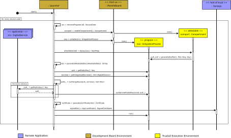
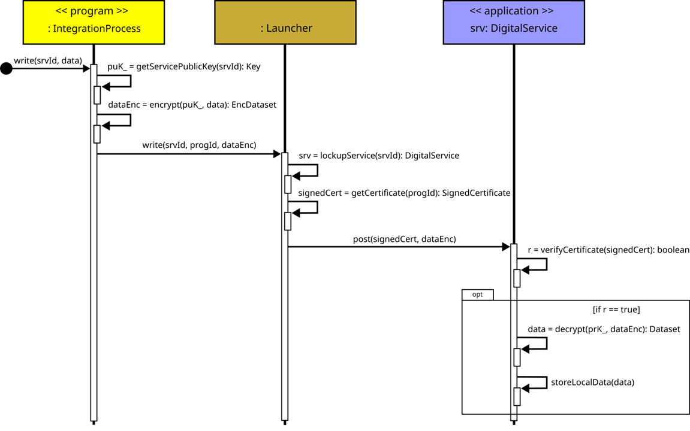

<h1 style="font-size: 2em;">A Use-case for Integrating Digital Services with Data Protection at Run Time</h1>

This repository focuses on evaluating two key attestable properties:

- The operation of the cloud-based attestation procedure discussed in the [attestablelauncher repository](https://github.com/CAMB-DSbD/attestablelauncher).
- Some performance properties of compartments created on a Morello Board, using a library compartmentalisation tool.

To explore these properties, we have implemented an **Enterprise Application Integration (EAI)** solution, also referred to as an **Integration Solution**, which operates within a trusted execution environment (TEE) on experimental Morello Board hardware.

In the implemented case study, a store offers a promotion to its customers: if a customer spends more than $150.00, they receive a ride home in an app-based car service, paid for by the store. This business strategy integrates the store’s operations with the transportation service, promoting sales and enhancing customer convenience through seamless digital service integration. The integration process is executed inside a TEE, demonstrating how secure communication and interaction between different digital services, running on distinct remote servers, can be achieved in a trusted environment.

We demonstrate how to execute an integration process within a TEE using Morello Board hardware located in Canada. The case study implements three mock digital services (apps) running on distinct remote servers in Brazil, along with an integration process (program) written and compiled for **CHERI capabilities (cheri-caps)**. The integration process runs inside a secure compartment.


## Conceptual View of the EAI

A conceptual view of the application involved in the EAI is illustrated in Figure 1.

<!-- -->


*Figure 1: Conceptual View of the EAI.* 
<!--(Author: Carlos Molina-Jimenez, Computer Lab, University of Cambridge. CAMB project).-->


The EAI integrates three main components: the store, taxi, and messaging services. These components act as servers, and the EAI operates as a client that sends requests to these services. The interaction between the EAI and the component applications follows a message-driven process:

1. The EAI requests a copy of the bill for a store's client, for example, Alice.
2. The store responds with the bill amount. Let's assume the bill is above $150.00, which entitles Alice to a courtesy taxi ride.
3. The EAI sends a request to the taxi service to arrange a ride for Alice.
4. The taxi service responds with the taxi's number and the driver’s name, confirming that a taxi is ready for boarding.
5. The EAI then sends a message to Alice, offering her the taxi service.
6. Alice responds with an acceptance of the offer.


## Implementation architecture of the EAI

As shown in Figure 2, to guarantee data privacy, we execute the integration process within a memory compartment. To illustrate the idea with a specific technology, we use compartments created on a Morello Board running the CheriBSD operating system. As explained above, the digital services are hosted on conventional computers. The architecture is composed of three main components: the `Launcher`, the `Integration Process`, and the `Digital Services`. Observe that the integration process acts as a client that places requests, through the Launcher, against the digital services that act as servers.


*Figure 2: Architecture of the integration process solution in the case study, designed using a trusted environment development approach.*  
<!-- (Author: Carlos Molina-Jimenez, Computer Lab, University of Cambridge. CAMB project) -->

The memory compartment is shown in a yellow box; the double lines indicate that it guarantees isolation and protection of sensitive data. The Launcher manages the interactions between the integration process and the digital services. Upon request from the Morello Board's manager, the Launcher retrieves the source code of the integration process from the `Code Repository`, then compiles and deploys the executable version in the memory compartment. Although the Launcher bridges the *read* and *write* actions, it does not have access to the data in transit since the data is always encrypted and decrypted at both ends.

To illustrate with an example, imagine that the integration process wants to verify if there are customers eligible for free taxis; a set of operations must be executed:

1. The `Integration Process` executes a `read()` action on the `Launcher`.
2. The `Launcher` translates the `read()` to a `request()` and forwards it to the `Store Service`, which responds with customers' latest transactions.
3. After examination, the `Integration Process` determines that there are eligible customers for free taxis and executes a `write()` action against the `Launcher` to send the eligible customers' details to the `Taxi Service`.
4. As a response, the `Launcher` translates the `write()` into a `post()` and forwards it to the `Taxi Service`.
5. The `Integration Process` executes a `write()` action on the `Launcher` to send the taxi booking confirmation to the `Messaging Service`.
6. The `Launcher` translates the `write()` into a `post()` and forwards it to the `Messaging Service`, which is programmed to send taxi booking confirmation messages to the awarded customers' mobile phones.

Note that data is transmitted encrypted over the communication channels. Well-known cryptographic techniques are available for protecting data in transit; for example, secure channels can be established between integration processes and each digital service using the SSL protocol. This approach would require public key certificates for authentication, which are also available.

<!--To illustrate the practicality of our current implementation, we highlight that the attestable is created on a Morello Board physically located in Toronto, while the applications run on conventional computers located at the Applied Computing Research Group of the University of Ijuí, Brazil.-->


# Functionality of the Components

### 1) App-Store, App-Transport, and App-Whatsapp

Each of these directories contains the following components:

- **API**: Each directory includes an API file (`API1.py`, `API2.py`, `API3.py`) responsible for providing specific endpoints:
  - **API1.py (App-Store)**: Provides the `/api/sales` endpoint to check the last sale.
  - **API2.py (App-Transport)**: Provides the `/api/trips` endpoint to book a trip.
  - **API3.py (App-Whatsapp)**: Provides the `/send-message` endpoint to send a confirmation message via WhatsApp.
- **Database**: The databases (`compras.db`, `transport_app.db`) are used to store relevant data for sales and transport bookings.
- **Key Pair**: Each application has its own key pair (`cert.pem`, `priv.pem`), used for secure communication.


### 2) Launcher

- **launcher.py**: A server that manages the upload, compilation, and execution of programs inside a TEE within secure compartments. It runs on the operating system outside the TEE and handles the following tasks:
  - Manages upload requests.
  - Compiles C code (`integration_process.c`) written with CHERI capabilities (cheri-caps).
  - Executes the compiled binary code inside a single compartment.
  - Creates and stores the required certificates locally, outside the TEE.
  
- **command-line-interface.py**: A command-line interface (CLI) client for interacting with the `launcher.py` server. It allows the user to:

  <div style="margin-left: 20px;">
    <ol>
      <li>List files.</li>
      <li>Upload a file.</li>
      <li>Delete a program.</li>
      <li>Compile a program.</li>
      <li>Execute a program.</li>
      <li>Exit.</li>
    </ol>
  </div>


- **generate_certificate.py**: This script generates certificates and keys for the `integration_process` executable binary code. The certificates include:
  - CPU model.
  - Number of CPUs.
  - Memory addresses.
  - Hash of the executable binary code.
  - Signature added to the certificate for attestation.

### Programs and Data Structure

- **programs-data-base/sources**: Contains the source code of programs written in C (e.g. `integration_process.c`).
- **programs-data-base/cheri-caps-executables**: Stores the executable binary codes generated for CHERI capabilities (cheri-caps).
- **programs-data-base/certificates**: Contains the attestables and the keys generated for the secure execution environment of each executable binary code.
- **attestable-data/signatures**: Stores the signatures of the executable binary codes for attestation purposes.

   
### Execution Sequence

1. **Launcher Initialisation**
   - The launcher is started by running `launcher.py`.
   - Once started, the launcher is ready to receive requests to upload, compile, and run programs.
   - To interact with the launcher, execute the command-line interface script using the following command:

     ```bash
     $ python3 command-line-interface.py
     ```

     This CLI provides a menu to manage the upload, compilation, and execution of integration processes.

2. **Code Upload**
   - The CLI (`command-line-interface.py`) is used to upload a C program (e.g. `integration_process.c`) to the Morello Board environment.
   - The launcher saves the uploaded file in the `programs-data-base/sources` folder and updates the `file_database.json`.

3. **Code Compilation**
   - A request to compile the source code is made via the CLI.
   - The launcher compiles the source code for CHERI capabilities and saves the executable binary code in the folder `programs-data-base/cheri-caps-executables`.
   - A corresponding certificate directory is created inside the folder `programs-data-base/certificates`.

4. **Code Execution**
   - The compiled binary code is executed via the CLI.
   - The launcher runs the binary and returns the output.

5. **Certificate Generation**
   - During execution, the `integration_process.c` calls the `generate_certificate.py` script located inside the folder `attestable-data`.
   - The `generate_certificate.py` script generates the corresponding keys and certificates for the running executable binary code, including information such as CPU model, number of CPUs, and memory addresses.

6. **Interaction with External APIs**
   - The `integration_process.c` makes HTTPS calls to the defined APIs (`API1_URL`, `API2_URL`, `API3_URL`), using OpenSSL to check sales, book trips, and send confirmation messages via WhatsApp.


<!--
# Attestation and Set-Up of the Attestable

The sequence diagram in Figure 3 represents the attestation and interaction process within the Integration Solution, managed by a **Launcher** program that operates outside the TEE but within the Morello Board operating system. The **Integration Process** functions as a client, interacting with remote servers hosting the digital service applications (apps).



*Figure 3: Deploying and Executing Integration Processes Inside a TEE.*
<!--(Author: Rafael Zancan-Frantz, Applied Computing Research Group, Unijui University, Brazil).-->


#### Explanation of the Sequence Diagram:

1. **Launcher Initialization**: The launcher begins the process by invoking the `start()` operation, which prepares the system to handle various operations, such as retrieving source code, compiling, and executing programs.

2. **Retrieving the Source Code**: For each source code, the launcher retrieves the necessary program (Integration Process) from its local database using the `retrieveProgram(id)` operation. This step fetches the source code of the **Integration Process**, essential for the subsequent operations.

3. **Compartment Creation**: The launcher requests the creation of a secure compartment by calling the `createCompartment()` operation in the Morello Board's operating system. This compartment provides a secure execution environment for the **Integration Process**.

4. **Source Code Compilation**: After retrieving the source code, the launcher compiles it for CHERI capabilities using the `compile(src)` operation. The result is an executable (`exe`) suitable for secure execution within the compartment.

5. **Deploying the Integration Process**: The compiled executable is then deployed within the compartment using the `deploy(exe)` operation. This deployment generates attestable data (`attestableData`), represented as a `HashMap`, which is crucial for ensuring the process operates securely inside the compartment.

6. **Key Pair Generation**: Inside the compartment, the **Integration Process** generates a key pair using the `generateKeyPair()` function. This pair consists of a public key (`puK`) and a private key (`prK`), which will be used for secure communication with the digital services.

7. **Certificate and Public Key Exchange**:
   - The `generateAttestableDoc()` operation is called to generate an attestable document containing the attestable data from the secure environment.
   - The public key of the **Integration Process** is retrieved using the `getPublicKey()` operation, ensuring secure interaction with external services.
   - The **Integration Process** gathers all available digital services using the `getIntegratedServices()` operation.
   - A key exchange occurs between the public key of the **Integration Process** and the external services using the `exchangeKeys(puK, services)` operation.

8. **Registering the Service's Public Key**: After the key exchange, the public keys of the digital services are securely stored via the `putServicePublicKey(srvId, puK_)` operation. This ensures that the keys are safely registered for communication with the **Integration Process**.

9. **Certificate Generation and Signing**: The launcher generates the final attestable certificate using the `generateCertificate(doc)` operation. This certificate is signed by a root certificate authority, such as Verisign, using the `sign(certificate)` operation to verify the integrity and authenticity of the process.

10. **Execution of the Integration Process**: Finally, the launcher invokes the `run()` operation, executing the compiled **Integration Process** within the secure compartment. At this point, the **Integration Process** can securely interact with external services (e.g., store, transportation, or messaging apps), ensuring data protection and the attestation of the trusted execution environment.

### Additional Considerations

- The secure compartment acts as a critical component in the execution, ensuring that all interactions and data exchanges remain encrypted and protected.
- The sequence of events includes not only the setup of the integration process but also important steps such as key exchange, certificate generation, and secure data transfer between services.
- The role of the root of trust (Verisign) ensures that the certificates used during the process are valid and can be trusted by external digital services.
-->
  

# Execution of a Read Action

## Implementation of the `read` Action using the iDevS API

The sequence diagram in Figure 4 details the operations involved. This diagram illustrates how the integration process requests data from a digital service (e.g., the Store Service).


The reading action starts when the `read()` operation (1) in the integration process (`exePrc`) is invoked, receiving as a parameter the digital service identifier `srvId`, which specifies the service from which data must be read (e.g., the ID of the `Store Service`). This invocation triggers a sequence of operations to complete the *read* action:

1. The integration process invokes the `read()` operation, passing the identifier `srvId` of the digital service from which it needs to read data.

2. The integration process forwards the `read()` request to the `Launcher`, appending the program identifier `progId` to uniquely identify the requesting integration process and validate its execution within the memory compartment of the TEE.

3. The `Launcher` executes the `lookupService()` operation to locate the service instance associated with `srvId`. The execution returns a reference to the corresponding integrated digital service (e.g., the `Store Service`).

4. To verify the trustworthiness of the requesting integration process, the `Launcher` invokes its `getCertificate()` operation, passing the program identifier `progId`. This operation retrieves the attestable certificate (`SignedCertificate`), following the X.509 standard[^1], generated from an attestation document and stored in PEM format[^2]. This certificate encapsulates essential attributes, such as the CPU model and the operating system version.

5. The `Launcher` invokes the `getProgramPublicKey()` operation to retrieve the public key (`Key`) associated with the current integration process. This key will be used later to encrypt the data transmitted between the components.

6. With the service reference and necessary cryptographic artifacts retrieved, the `Launcher` invokes the `request()` operation on the digital service, providing the attestable certificate (`signedCert`) and the public key (`puK`). The digital service uses these to authenticate the request and confirm that it originates from a trusted environment.

7. Upon receiving the request, the digital service invokes its `verifyCertificate()` operation to validate the received certificate. The verification process involves:
   - **Step 1:** Checking whether the certificate was issued and signed by a trusted Root Certificate Authority (CA), such as VeriSign[^3], to ensure authenticity.  
   - **Step 2:** Validating the attestable attributes (e.g., CPU model and OS version) to confirm that the integration process is running within a trusted environment.

   If the certificate is invalid, the request is rejected, and no data is retrieved.

8. If the certificate is valid (`r == true`), the digital service retrieves the requested data (`Dataset`) locally using its `retrieveLocalData()` operation. The data can be structured, for example, in JSON format, to facilitate compatibility between digital services and integration processes.

9. To secure the data during transmission, the digital service invokes its `encrypt()` operation, encrypting the data using the public key (`puK`) of the integration process. The result is an encrypted dataset (`EncDataset`) that ensures confidentiality throughout the entire *read* action.

10. The encrypted dataset is securely transmitted (e.g., via HTTPS) to the `Launcher`, which forwards it to the integration process. Upon receiving the encrypted data, the integration process invokes its `decrypt()` operation using its private key (`prK`) to recover the original dataset (`Dataset`) and proceed with its processing.

---

[^1]: X.509 is a widely used standard for digital certificates.  
[^2]: PEM is an encoding format for storing digital certificates.  
[^3]: Root CA: [VeriSign](https://www.verisign.com/)


# Execution of a Write Operation

The integration process is responsible for securely sending processed data within the integration flow to integrated digital services. This process is carried out through a write operation, with the **Integration Process** acting as the client and the **Digital Service** as the server. The diagram in **Figure 5** illustrates the sequence of events during the execution of a write operation that the EAI performs to send data to one of the applications, such as a messaging service. For instance, the EAI executes a write operation to the messaging application to notify it that a client is ready for a taxi ride home.



*Figure 5: Writing data to a digital service.*
<!--(Author: Rafael Zancan-Frantz, Applied Computing Research Group, Unijuí University, Brazil).-->

The sequence diagram in **Figure 5** provides a structured view of how data is securely transmitted from the **Integration Process** to a **Digital Service**. Below is an explanation of the steps involved in the write operation:

1. **Initiating the Write Request**: The **Integration Process** initiates a write request, specifying the destination **Digital Service**, identified by `srvId`, and the data to be sent.

2. **Retrieving the Public Key of the Service**: The **Integration Process** retrieves the public key (`puK_`) of the **Digital Service** using the `getServicePublicKey(srvId)` operation. This public key will be used to encrypt the data, ensuring secure transmission.

3. **Encrypting the Data**: The data is encrypted using the public key (`puK_`) retrieved in the previous step. The result is an encrypted dataset (`dataEnc`), which will be securely transmitted to the service.

4. **Sending the Encrypted Data**: The **Integration Process** sends the encrypted data (`dataEnc`) to the **Launcher** via the `write(srvId, progId, dataEnc)` operation. The `progId` identifies the integration process.

5. **Service Lookup**: The **Launcher** searches for the digital service using the `lockupService(srvId)` operation to locate the corresponding **Digital Service** for this request.

6. **Retrieving the Certificate**: The **Launcher** retrieves the signed certificate of the **Integration Process** using the `getCertificate(progId)` operation, which will be used to verify the integrity of the process.

7. **Sending the Encrypted Data**: The **Launcher** securely sends the encrypted data and the signed certificate to the **Digital Service** using the `post(signedCert, dataEnc)` operation.

8. **Verifying the Certificate**: The **Digital Service** verifies the provided certificate using the `verifyCertificate(signedCert)` operation. If the certificate is valid (`r == true`), the service proceeds to process the data.

9. **Decrypting the Data**: The **Digital Service** decrypts the encrypted data (`dataEnc`) using its private key (`prK_`), recovering the original dataset (`Dataset`).

10. **Storing the Data**: The decrypted data is locally stored in the service using the `storeLocalData(data)` operation, completing the write operation.

This sequence ensures that the data sent from the **Integration Process** to the **Digital Service** is encrypted and protected during transmission, with the **Launcher** acting as the communication facilitator without having access to the data. The encryption and attestable-based verification guarantee that only authorised and trusted integration processes can write data to the digital service.


<!--
## Acknowledgements

Special thanks to **Carlos Molina-Jimenez** ([carlos.molina@cl.cam.ac.uk](mailto:carlos.molina@cl.cam.ac.uk)), 
from the Computer Lab, University of Cambridge, for providing the architecture images, assisting in identifying the research problem, and supporting the project development as part of the CAMB project.

The UML diagrams were created by **Rafael Zancan-Frantz** ([rzfrantz@unijui.edu.br](mailto:rzfrantz@unijui.edu.br)), 
from the Applied Computing Research Group at Unijui University, Brazil. Along with **Carlos Molina-Jimenez**, Rafael served as mentor and guide throughout the entire project.


## Corresponding Author

**Regis Rodolfo Schuch**  
*Applied Computing Research (GCA) Group, Unijui University, Brazil*  
[regis.schuch@unijui.edu.br](mailto:regis.schuch@unijui.edu.br)
-->
