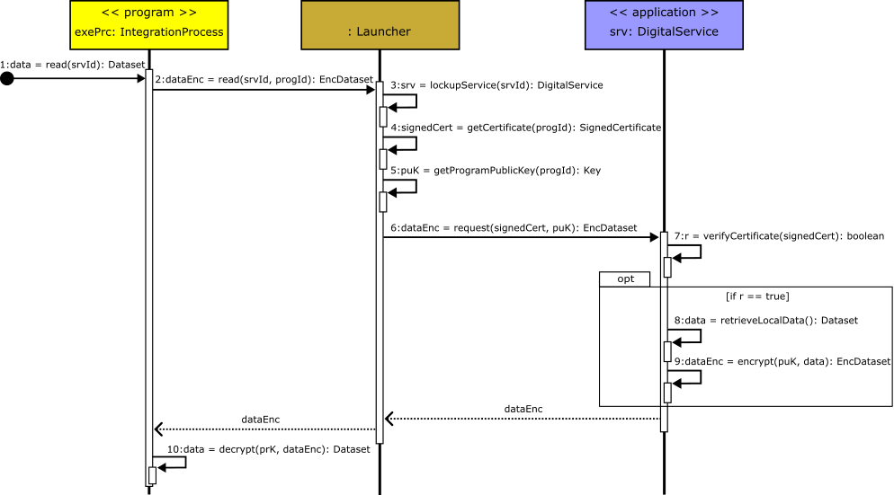

# A Use-case for Integrating Digital Services with Data Protection at Run Time

The integration of digital services often involves sensitive data which is traditionally executed in untrusted execution environments that expose it to exfiltration risks, putting security and privacy under threat. This is unacceptable in applications that compute highly sensitive data. To address this issue, we present **iDevS**, an API designed for the development and execution of integration processes within **Trusted Execution Environments (TEEs)**. We use smart cities as a context where such APIs are missing, e.g. to process medical data. A salient feature of iDevS~API is that it is independent of underlying technologies. It ensures data protection at execution-time and supports attestation of the execution environment. We discuss a case study to demonstrate how it can be used.

---

## Evaluation Focus

This repository focuses on evaluating two key attestable properties:

- The operation of the cloud-based attestation procedure discussed in the [attestablelauncher repository](https://github.com/CAMB-DSbD/attestablelauncher).
- Some performance properties of compartments created on a Morello Board, using a library compartmentalisation tool.

To explore these properties, we have implemented an **Enterprise Application Integration (EAI)** solution, also referred to as an **Integration Process**, which operates within a trusted execution environment (TEE) on experimental Morello Board hardware.

We demonstrate how to execute an integration process within a TEE using Morello Board hardware located in Canada. The case study implements three mock digital services (apps) running on distinct remote servers in Brazil, along with an integration process (program) written and compiled for **CHERI capabilities (cheri-caps)**. The integration process runs inside a secure compartment.

---

## System Requirements

The evaluation was conducted using the following system configuration:

- **Hardware**: Research Morello Board (Research Morello SoC r0p0)
- **CPU**: 4 cores
- **RAM**: 16 GB DDR4 ECC (2933 MT/s)
- **Architecture**: aarch64c with CHERI support
- **Operating System**: CheriBSD 22.12 (FreeBSD 15.0-CURRENT)
- **Execution Model**: CheriABI processes using purecap ABI
- **Compartmentalisation**: Enabled at compile- and runtime for all binaries

---

## Integration Problem Overview


*Figure 1: Conceptual View of the EAI.*

The scenario represents a store’s strategy to retain customers by offering free transport home to those who spend at least $150. These customers receive booking confirmations via mobile. The integration process securely automates interactions among three services:

- **Store Service** – Retrieves purchases and customer data.
- **Taxi Service** – Books transport.
- **Messaging Service** – Sends WhatsApp confirmations.

The integration process:

1. Periodically performs *read()* on the Store Service.
2. Checks if purchases ≥ $150.
3. Issues *write()* to the Taxi Service.
4. Issues *write()* to the Messaging Service.

---

## Integration Process Design


*Figure 2: Architecture of the integration solution using TEE and CHERI compartments.*

The `Integration Process` runs in a secure memory compartment on Morello. The `Launcher` orchestrates upload, compilation, certificate generation, and execution of the binary. Digital services remain external.

The Launcher bridges encrypted communications without access to data contents. It compiles source files, generates X.509 attestables, and executes the program in an isolated compartment.

---

## Execution of a Read Action



*Figure 3: Read action flow – from integration process to digital service.*

1. Integration process invokes `read(srvId)`.
2. Launcher validates program certificate and service reference.
3. Digital service checks the certificate and sends back encrypted data.
4. Integration process decrypts the response using its private key.

---

## Execution of a Write Action


*Figure 4: Write action flow – sending data securely to digital service.*

1. Integration process encrypts the dataset with the service’s public key.
2. Calls `write(srvId, dataEnc)` on the Launcher.
3. Launcher attaches certificate and forwards the request.
4. Digital service validates certificate, decrypts data, and stores locally.

---

## Implementation and Execution

### App-Store, App-Transport, and App-Whatsapp

Each service includes:

- **API** (`API1.py`, `API2.py`, `API3.py`)
- **Database** (`compras.db`, `transporte_app.db`)
- **Key pair** (`cert.pem`, `priv.pem`)
- **Certificate verification** (`verifyCertificate.py`)

| Service         | Endpoint            | Purpose                           |
|----------------|---------------------|------------------------------------|
| App-Store      | `/api/sales`        | Check last sale                    |
| App-Transport  | `/api/trips`        | Schedule transport                 |
| App-Whatsapp   | `/send-message`     | Send WhatsApp booking confirmation |

---

### Launcher

Responsible for managing:

- Upload, compile and execution of CHERI-enabled programs
- Generation of attestable certificates
- Certificate signing and keypair management

#### Key Files

- `launcher.py`: Main server interface
- `command-line-interface.py`: Menu-driven CLI client
- `generate_certificate.py`: Creates X.509 certificates for integration processes
- `file_database.json`: Tracks uploaded and compiled files

#### Directory Structure

```plaintext
launcher/
├── launcher.py                       # Core logic of the launcher
├── command-line-interface.py         # CLI client to interact with the launcher
├── attestable-data/
│   ├── generate_certificate.py       # Script to generate X.509 certificates
│   └── signatures/                   # Digital signatures of binaries
├── programs-data-base/
│   ├── file_database.json            # JSON metadata about uploaded programs
│   ├── sources/                      # Source files (*.c)
│   ├── cheri-caps-executables/       # Compiled binaries with CHERI capabilities
│   └── certificates/                 # Generated certificates for binaries
├── keys/
│   ├── cert.pem                      # Root certificate
│   ├── prk.pem                       # Private key
│   └── puk.pem                       # Public key
```

---

### Execution Sequence

1. **Start Launcher**
   ```bash
   python3 launcher.py
   ```

2. **Run the CLI**
   ```bash
   python3 command-line-interface.py
   ```

3. **Upload Source Code**
   - Select option to upload `.c` program (e.g., `integration_process.c`).

4. **Compile**
   - Compiles using `clang-morello` with `-mabi=purecap`.

5. **Execute**
   - Runs the binary inside a CHERI memory compartment.

6. **Certificate Generation**
   - `generate_certificate.py` is invoked to embed system/hardware data in a signed X.509 certificate.

7. **Inter-service Communication**
   - The binary calls external APIs (`API1`, `API2`, `API3`) securely over HTTPS using OpenSSL.


